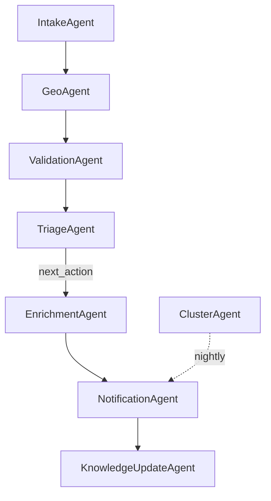

# Eight-agent topology

!!! note "Stub"
    Authored in Phase 3. Source: [`plan/03-agentic-architecture.md`](https://github.com/tyson-swetnam/epihack-2026/blob/main/plan/03-agentic-architecture.md).

Each agent is a Pydantic v2 model. The contracts live in
`agents/src/onehealth_agents/contracts.py`. The orchestrator in
`orchestrator.py` runs them in dependency order; the dispatcher in
`mcp_client.py` fans out tool calls per server-prefix.
