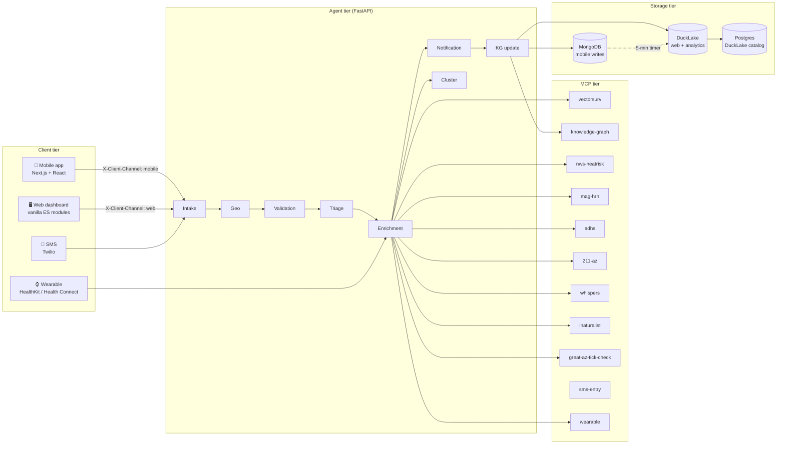

# System overview

```mermaid
flowchart LR
  subgraph "Client tier"
    PH[📱 Mobile app<br/>Next.js + React]
    WB[🖥 Web dashboard<br/>vanilla ES modules]
    SMS[📨 SMS<br/>Twilio]
    WR[⌚ Wearable<br/>HealthKit / Health Connect]
  end
  subgraph "Agent tier (FastAPI)"
    IN[Intake] --> GE[Geo] --> VAL[Validation]
    VAL --> TR[Triage] --> ENR[Enrichment] --> NOT[Notification]
    ENR --> CL[Cluster]
    NOT --> KGW[KG update]
  end
  subgraph "MCP tier"
    M1[vectorsurv]
    M2[knowledge-graph]
    M3[nws-heatrisk]
    M4[mag-hrn]
    M5[adhs]
    M6[211-az]
    M7[whispers]
    M8[inaturalist]
    M9[great-az-tick-check]
    M10[sms-entry]
    M11[wearable]
  end
  subgraph "Storage tier"
    MGO[(MongoDB<br/>mobile writes)]
    DL[(DuckLake<br/>web + analytics)]
    PG[(Postgres<br/>DuckLake catalog)]
  end
  PH -->|X-Client-Channel: mobile| IN
  WB -->|X-Client-Channel: web| IN
  SMS --> IN
  WR --> ENR
  ENR --> M1 & M3 & M4 & M5 & M6 & M7 & M8 & M9 & M11
  KGW --> M2
  KGW --> MGO
  KGW --> DL
  DL --> PG
  MGO -. 5-min timer .-> DL
```

See the [eight-agent topology](agents.md), the
[privacy contract](privacy.md), and the
[four worked data flows (A/B/C/D)](data-flows.md) for the details
behind each box.
