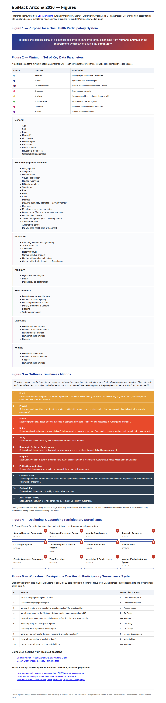
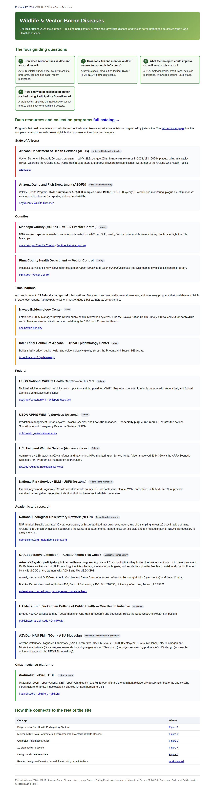

# 01 · Frame the problem

## What we wanted

A working knowledge framework for participatory One Health surveillance
in Arizona, anchored on artifacts produced by the EpiHack participants
themselves: the five reference figures from the Ending Pandemics Academy
curriculum, the four guiding questions from each of two focus groups
(Wildlife & Vector-Borne Disease, Heat), the completed design worksheets
the teams turned in, and the World Café Q4 cards on what public
engagement has actually worked in the field. The point wasn't to invent
a new theory of surveillance — it was to turn the figures, focus groups,
and engagement evidence into something a contributor on Monday morning
could query, extend, and ship code against.

## What we built

- **Five reference figures**, each transcribed from poster format into
  structured Markdown + RDF-style triples under
  [`figures/`](https://github.com/tyson-swetnam/epihack-2026/blob/main/figures).
  [Figure 1](https://github.com/tyson-swetnam/epihack-2026/blob/main/figures/01-purpose-one-health-participatory-system.md)
  is the purpose statement; [Figure 2](https://github.com/tyson-swetnam/epihack-2026/blob/main/figures/02-minimum-key-data-parameters.md)
  is the eight-class minimum dataset; [Figure 3](https://github.com/tyson-swetnam/epihack-2026/blob/main/figures/03-outbreak-timeliness-metrics.md)
  is the eleven outbreak-timeliness milestones; [Figure 4](https://github.com/tyson-swetnam/epihack-2026/blob/main/figures/04-designing-launching-participatory-surveillance.md)
  is the 12-step design-and-launch lifecycle; [Figure 5](https://github.com/tyson-swetnam/epihack-2026/blob/main/figures/05-design-worksheet-template.md)
  is the ten-prompt design worksheet that anchors every other artifact
  on the page.
- **Two focus groups**, each with four numbered guiding-question pages
  plus a full anchor-resource catalog. [`wildlife/`](https://github.com/tyson-swetnam/epihack-2026/blob/main/wildlife)
  covers wildlife tracking, zoonotic surveillance, surveillance
  technology, and the participatory-design draft; [`heat/`](https://github.com/tyson-swetnam/epihack-2026/blob/main/heat)
  covers cooling-center awareness, real-time resource sharing, heat
  safety education, and the vulnerability profile. Both resource pages
  span state, county, tribal, federal, academic, and citizen-science
  jurisdictions.
- **Two completed design worksheets** under
  [`worksheets/`](https://github.com/tyson-swetnam/epihack-2026/blob/main/worksheets):
  worksheet
  [01 — unusual animal-health events as an early warning signal](https://github.com/tyson-swetnam/epihack-2026/blob/main/worksheets/01-animal-health-events.md)
  and worksheet
  [02 — desert urban-wildlife and hobby-farm interface](https://github.com/tyson-swetnam/epihack-2026/blob/main/worksheets/02-desert-wildlife-interface.md).
  Each is a literal answer-by-answer fill-in of the ten Figure 5
  prompts.
- **Three World Café Q4 cards** transcribed from the breakout walls
  under [`notes/world-cafe/`](https://github.com/tyson-swetnam/epihack-2026/blob/main/notes/world-cafe):
  Heat, Unhoused, and Information Flow. Each card answers the same
  Q4 prompt — *"What is an example of directly engaging with the
  public that was really successful?"* — and produced the tactic list
  that later seeded the Notification and Enrichment agents.
- **A knowledge-graph encoding** of all of the above. The
  ten-prompt worksheet template, the lifecycle precedence chain, the
  eight parameter categories, and the completed worksheet instances
  all land as `kg.node` / `kg.edge` / `kg.property` rows in
  [`schema/system_designs.sql`](https://github.com/tyson-swetnam/epihack-2026/blob/main/schema/system_designs.sql)
  and [`schema/world_cafe.sql`](https://github.com/tyson-swetnam/epihack-2026/blob/main/schema/world_cafe.sql).
  See [`kg.v_design_summary`](../kg/queries.md) for the wide view.

## What it looks like

The five reference figures, with each parameter linked back to its
`kg.node` slug, look like this on the published site:

And the two focus-group landings — the Wildlife & Vector-Borne Diseases
side and the Heat side, each anchoring the resource catalogs that became
[Plan 02](02-map.md):

## Decisions & trade-offs

**Why participatory One Health surveillance for Arizona specifically.**
Arizona is the hottest large metropolitan region in the United States,
and the [heat focus group](https://github.com/tyson-swetnam/epihack-2026/blob/main/heat/04-vulnerable-populations.md)
opens with the headline numbers — more than 4,320 heat-exposure deaths
between 2013 and 2024, 990 in 2023 alone, and a 36% unsheltered share
of 2016 Maricopa heat deaths — that no single agency dataset captures
on its own. The state is also home to 22 federally recognized tribal
nations, 15 county vector-control programs, the NEON Domain 14 desert-
southwest observatory at Santa Rita, and the only flagship participatory
tick-surveillance program in the region (the UA Great Arizona Tick
Check). The jurisdictional spread is the whole problem: any signal that
matters crosses agencies before it crosses sectors.

**Why VBD and Heat, and not foodborne, AMR, or opioids.** Those four
were on the table. We chose Vector-Borne Disease and Heat because they
share a single property that the others don't: the *environmental* class
of [Figure 2](https://github.com/tyson-swetnam/epihack-2026/blob/main/figures/02-minimum-key-data-parameters.md)
is the load-bearing one. Mosquito density, standing water, ambient
temperature, HeatRisk colour, and cooling-center proximity are all
real-time, machine-readable signals that an MCP server can stream
without negotiating PHI access. Foodborne and AMR surveillance leans
much harder on clinical records (FoodNet, NHSN, eCR) where the data-use
agreements alone take longer than a hackathon. The Wildlife and Vector-
Borne Disease focus group also already overlapped with Heat through
shared environmental drivers (rainfall → mosquito habitat; heatwave →
outdoor-worker exposure during peak WNV weeks), so two verticals could
share most of the schema.

**Why we kept the framework jurisdiction-aware from day one.** The
World Café Q4 cards forced this. *Train-the-Trainer → Western Regional
Public Health (HHS Region 9)* is a 12-year-old program. *Community
Health Workers → assess heat risk to homes* is a tactic Maricopa CHWs
already run. *Dating apps → STI services* was even on a card (with the
participants' own "??" attached, which we preserved). *Healthy
Companions* and the *shelter app* came off the Unhoused card.
*Geo-targeted emergency health alerts* and *Epic EMRs in collaboration
with TMC* came off the Information Flow card. None of those tactics
work if the schema doesn't know which county, tribe, or CHW network a
report belongs to — so `kg.edge(subject_id, predicate, object_id)`
treats county / tribe / agency / network as first-class nodes from the
first seed, not as columns bolted on later.

**Why the worksheet template is in SQL, not Markdown.** Figure 5 has
ten prompts and the focus groups produced two filled-in worksheet
instances on day one. By making
[`schema/system_designs.sql`](https://github.com/tyson-swetnam/epihack-2026/blob/main/schema/system_designs.sql)
the canonical template (with the ten prompts as `worksheet_prompt`
nodes and each completed answer as a `worksheet_answer` edge back to
its design), the same SQL view that summarises the two completed
worksheets will summarise the thirtieth — no transcription step,
no schema drift. The
[`kg.v_design_summary`](../kg/queries.md) view is the receipt.

**Where the World Café tactics actually landed.** The CHW heat-risk
home check became
[the `211-az-mcp` transport-dispatch flow](../mcps/211-az.md).
*Train-the-Trainer Region 9* maps to the Phase 1 awareness-campaign
milestones in
[`plan/05-roadmap.md`](https://github.com/tyson-swetnam/epihack-2026/blob/main/plan/05-roadmap.md#phase-1--heat-vertical-month-12).
The shelter app and dating-apps tactics didn't ship as code, but
they're encoded as `engagement_tactic` nodes in
[`schema/world_cafe.sql`](https://github.com/tyson-swetnam/epihack-2026/blob/main/schema/world_cafe.sql)
so the next team can pull them up via
[`kg.v_engagement_tactics`](../kg/queries.md) without re-reading the
cards.

!!! quote "Worksheet 01, prompt 9 — Validation"
    *"Deploy first to populations like animal control, veterinarians,
    and veterinary students. Filter by IP address, ZIP code, frequency
    of reporting a particular event, veterinary follow-up, diagnostic
    follow-up, symptom cluster."*

That single answer set the direction for three later pieces of the
stack: the
[Validation Agent's coarse-geo + duplicate-suppression checks](../architecture/agents.md),
the [Cluster Detection Agent's ZCTA-week aggregation](../architecture/data-flows.md),
and the entire [privacy contract in `validation.py`](../architecture/privacy.md).
The worksheets weren't decoration. They drove the build.

!!! note "What the framework is not"
    The framework is not a survey instrument. It does not collect
    diagnoses. It does not run on agency record systems. It is a
    queryable encoding of *the prior knowledge in the room* —
    figures, focus-group materials, worksheets, and World Café cards
    — so every later code change can be motivated by something a
    reviewer can cite back to a poster, a transcript, or a worksheet
    answer.

## Where to go next

[02 · Map the data sources →](02-map.md)
