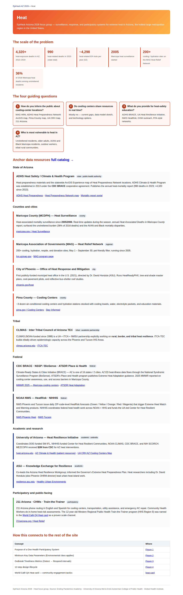
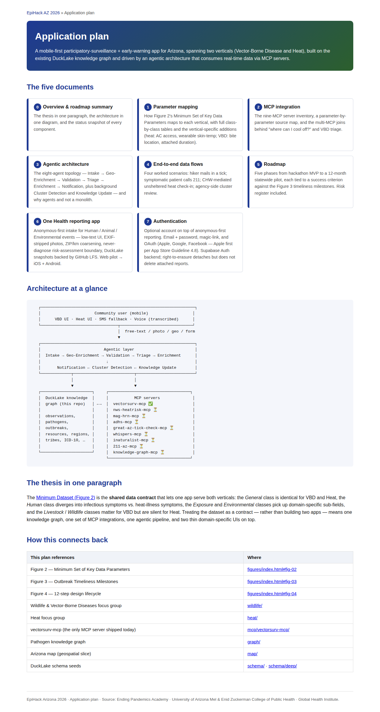

# 02 · Map the data sources

## What we wanted

A canonical mapping between
[Figure 2's eight-class minimum dataset](https://github.com/tyson-swetnam/epihack-2026/blob/main/figures/02-minimum-key-data-parameters.md)
and the real-world APIs that could populate it — so every "we should
report this signal" conversation could end with a concrete endpoint
URL, an auth posture, an update cadence, and an explicit answer to
"do we wrap this as an MCP server or not?". The focus groups had
already produced more than thirty anchor resources between them; the
job was to thin that catalog down to a shortlist a hackathon team
could actually ship.

## What we built

- **Class-by-class parameter mapping** in
  [`plan/01-parameter-mapping.md`](https://github.com/tyson-swetnam/epihack-2026/blob/main/plan/01-parameter-mapping.md).
  Each of the eight Figure 2 classes (General, Human, Severity,
  Exposure, Auxiliary, Environmental, Livestock, Wildlife) gets a
  row-by-row table showing which parameters apply to VBD, which apply
  to Heat, and where each one lands as a `kg.property` on the
  `observation` node. The Heat-specific additions (confusion / altered
  mental status, hot-dry skin, AC access, energy security, sheltered
  status, occupational heat exposure today, thermoregulation-affecting
  medications) live in the same document so the schema delta is
  visible in one place.
- **The MCP integration topology** in
  [`plan/02-mcp-integration.md`](https://github.com/tyson-swetnam/epihack-2026/blob/main/plan/02-mcp-integration.md).
  Same idea, but inverted: each parameter that *can* be populated from
  upstream is tied to the MCP server and tool that populates it.
- **The full dataset + API catalog** at
  [`schema/deep/datasets_apis.sql`](https://github.com/tyson-swetnam/epihack-2026/blob/main/schema/deep/datasets_apis.sql)
  — 24 dataset nodes and 11 API nodes (edge-id range 13000–13999),
  every one carrying `url`, `format`, `update_cadence`,
  `license_or_terms`, and `auth_required` properties, with an
  `operatedBy` edge back to the agency. Anything *not* wrapped as an
  MCP today is still in this seed, so the next team can pick up the
  next one without re-doing the literature review.
- **The eleven-server MCP shortlist** in
  [`mcp/README.md`](https://github.com/tyson-swetnam/epihack-2026/blob/main/mcp/README.md)
  — the servers we actually built and tested offline. The Phase 0–2
  ordering in
  [`plan/05-roadmap.md`](https://github.com/tyson-swetnam/epihack-2026/blob/main/plan/05-roadmap.md)
  is the reason they shipped in the order they did.

## What it looks like

The Heat focus group landing — same shape as Wildlife & VBD on
[Plan 01](01-frame.md), but with a different resource catalog (ADHS
BRACE, MAG HRN, NWS HeatRisk, 211 AZ, UA Heat Resilience Initiative):

And the Application Plan landing — the nine-part Sentinel plan
(01–09) plus the new Plan 10 (this archival pass) and the
post-EpiHack Ansible audit:

## Decisions & trade-offs

**The eight-class minimum dataset is the anchor, not a starting menu.**
We treated [Figure 2](https://github.com/tyson-swetnam/epihack-2026/blob/main/figures/02-minimum-key-data-parameters.md)
as a contract: every parameter has a home in the property graph
(`kg.property(observation.X, key, value_*)`), and nothing the app
collects lands *outside* a Figure 2 class without a matching
`kg.node_type`. The two classes the worksheet teams flagged as needing
vertical-specific extensions — *Exposure* (AC access, occupational
heat exposure, sheltered status) and *Environmental* (HeatRisk colour,
heat index, ambient temperature) — are where most of the Heat-vertical
MCP work concentrated.

**The shortlist that became Phase 1 MCP work.** The
[Phase 0–1 roadmap](https://github.com/tyson-swetnam/epihack-2026/blob/main/plan/05-roadmap.md)
picked one mature server per class of *upstream data*, so the worked
scenarios in
[`plan/04-data-flows.md`](https://github.com/tyson-swetnam/epihack-2026/blob/main/plan/04-data-flows.md)
could all execute without a missing dependency.

| Tier | Servers | Why these |
|---|---|---|
| **Federal real-time** | [`vectorsurv-mcp`](../mcps/vectorsurv.md), [`nws-heatrisk-mcp`](../mcps/nws-heatrisk.md), [`whispers-mcp`](../mcps/whispers.md) | Public APIs with versioned OpenAPI specs and well-defined auth. VectorSurv carries Phase 0 by itself (pools, collections, vector-index math, case counts); HeatRisk is the load-bearing live feed for Heat; WHISPers is the wildlife-mortality counterpart for VBD. |
| **State + regional** | [`adhs-mcp`](../mcps/adhs.md), [`mag-hrn-mcp`](../mcps/mag-hrn.md), [`211-az-mcp`](../mcps/211-az.md) | None has a fully open REST API today, so all three ship mock-by-default — canned data from the upstream PDFs / ArcGIS feature service / resource directory behind an env-overridable backend URL the agency can drop into later. |
| **Citizen-science + academic** | [`inaturalist-mcp`](../mcps/inaturalist.md), [`great-az-tick-check-mcp`](../mcps/great-az-tick-check.md) | iNaturalist (200M+ observations globally) covers AZ vectors and reservoirs. Great Arizona Tick Check is Arizona's flagship mail-in tick program out of UA Entomology — already discovered Gulf Coast ticks in Cochise / Santa Cruz and Western black-legged ticks in Mohave. Mock-by-default until the Walker lab ships a real backend. |
| **Local knowledge graph** | [`knowledge-graph-mcp`](../mcps/knowledge-graph.md) | Read-only DuckDB MCP over the EpiHack DuckLake graph (572 nodes / 791 edges / 1027 properties), plus a SELECT-only SQL escape hatch. This is the *internal* feed every other agent calls to resolve a report's coarse geo into county / tribe / focus-area / population edges. |
| **Intake channels (not data sources)** | [`sms-entry-mcp`](../mcps/sms-entry.md), [`wearable-mcp`](../mcps/wearable.md) | The only servers that don't wrap an upstream catalog. SMS does Twilio HMAC-SHA1 verification + intent parsing; wearable ships HealthKit / Health Connect skin-temp, HRV, sweat-rate, and heart-rate with an on-device-only posture. Channels, not catalogs. |

**Why those tiers, and not "wrap everything ADHS has".** The catalog in
[`schema/deep/datasets_apis.sql`](https://github.com/tyson-swetnam/epihack-2026/blob/main/schema/deep/datasets_apis.sql)
is much larger than the wrapped-MCP shortlist. We deliberately kept
several sources *in the catalog but out of the MCP layer*:

- **NEON data products** (DP1.10043.001 mosquito CO2, DP1.10092.001
  tick-borne pathogen status, plus five more at Domain 14 Santa Rita).
  Public, CC0, but monthly cadence; suits offline analytic baseline,
  not real-time triage. Reachable through the
  [`kg_sql`](../mcps/knowledge-graph.md) escape hatch.
- **CDC NSSP / BioSense (ESSENCE), RCKMS, HHS Heat & Health Index,
  CDC EPHT.** ESSENCE has near-real-time ED chief-complaint data but
  is gated by an NSSP Data Use Agreement that takes longer than a
  hackathon. Nodes seeded; wrappers left as follow-ups.
- **HRRR / RTMA / NDFD GRIB2.** `nws-heatrisk-mcp` already exposes
  the point-forecast + HeatRisk + alert tools the app consumes through
  `api.weather.gov`; the GRIB2 stack is a heavier dependency for a
  marginal Phase 0 upgrade.
- **eBird API 2.0 and GBIF Occurrence.** iNaturalist alone covers the
  AZ ticks, mosquitoes, fleas, and rodent reservoirs the participatory
  side needs. eBird + GBIF matter more for an HPAI expansion in Phase 4.
- **A future `outbreaks-near-me-mcp`** — federation with Boston
  Children's [Outbreaks Near Me](https://outbreaksnearme.org/us/en-US)
  (the successor to Flu Near You) is documented in
  [`plan/02-mcp-integration.md`](https://github.com/tyson-swetnam/epihack-2026/blob/main/plan/02-mcp-integration.md#mcp-server-inventory)
  as a planned-not-built item, gated on a partnership with the
  HealthMap team.

**Keep all five jurisdictions in the mix.** The
[`wildlife/`](https://github.com/tyson-swetnam/epihack-2026/blob/main/wildlife/index.html)
focus group landed on this spread explicitly, and the MCP shortlist
preserves it: federal (VectorSurv + WHISPers + NWS), state (ADHS),
regional / county (MAG HRN, plus Maricopa Vector Control via
VectorSurv agency-region joins), academic (UA Great Arizona Tick
Check), citizen-science (iNaturalist). Tribal data is deliberately
*not* wrapped at Phase 0 — Phase 2 governance work has to land first
per [`GOVERNANCE.md`](https://github.com/tyson-swetnam/epihack-2026/blob/main/GOVERNANCE.md).
The 22 federally recognized tribal nations are still nodes in
[`schema/deep/tribes.sql`](https://github.com/tyson-swetnam/epihack-2026/blob/main/schema/deep/tribes.sql),
and the `consent_profile` machinery in
[`schema/deep/application.sql`](https://github.com/tyson-swetnam/epihack-2026/blob/main/schema/deep/application.sql)
suppresses tribal data at write time by default — the schema-side
counterpart to the "no tribal MCP at Phase 0" rule.

**Intake channels are deliberately not catalog-shaped.** The wearable
and SMS servers don't appear in
[`datasets_apis.sql`](https://github.com/tyson-swetnam/epihack-2026/blob/main/schema/deep/datasets_apis.sql)
because they aren't catalogs — they're inputs. Both terminate at
[the `POST /v1/reports` endpoint](../architecture/data-flows.md) under
the same privacy enforcement in
[`validation.py`](https://github.com/tyson-swetnam/epihack-2026/blob/main/agents/src/onehealth_agents/validation.py)
and the same two-store split documented in
[`plan/09-mobile-datastore.md`](https://github.com/tyson-swetnam/epihack-2026/blob/main/plan/09-mobile-datastore.md).
Wrapping them as MCP servers cost almost nothing — the Twilio HMAC
check and the HealthKit reading parser are exactly the kind of small,
stateless logic FastMCP is good at — and bought us the ability to
exercise either channel from Claude Desktop without spinning up the
agent pipeline.

!!! tip "Reading the catalog as a query"
    Every dataset and API in
    [`schema/deep/datasets_apis.sql`](https://github.com/tyson-swetnam/epihack-2026/blob/main/schema/deep/datasets_apis.sql)
    is reachable via SQL through the
    [`knowledge-graph-mcp`](../mcps/knowledge-graph.md) read-only
    server. *What MCP tools answer Heat Q1?* and *What datasets does
    NEON operate at Santa Rita?* are both one-line joins on
    `kg.edge.predicate IN ('operatedBy', 'informs', 'wraps')`. See
    [`docs/kg/queries.md`](../kg/queries.md) for the worked examples.

!!! note "When the source has no API"
    Several of the most important AZ sources publish PDFs and ArcGIS
    dashboards but not REST endpoints — most visibly ADHS Heat
    Mortality Surveillance and the Maricopa County Heat-Associated
    Deaths report series. The corresponding MCP servers
    ([`adhs-mcp`](../mcps/adhs.md), [`mag-hrn-mcp`](../mcps/mag-hrn.md))
    ship canned data drawn from the published reports plus an
    env-overridable backend URL, so the day the agency publishes a
    real endpoint, the MCP server picks it up without a code change.
    The README for each server is explicit about its mock posture and
    the sunset clause that applies if the upstream never materialises.

## Where to go next

[03 · Build the MCPs →](03-mcps.md)
