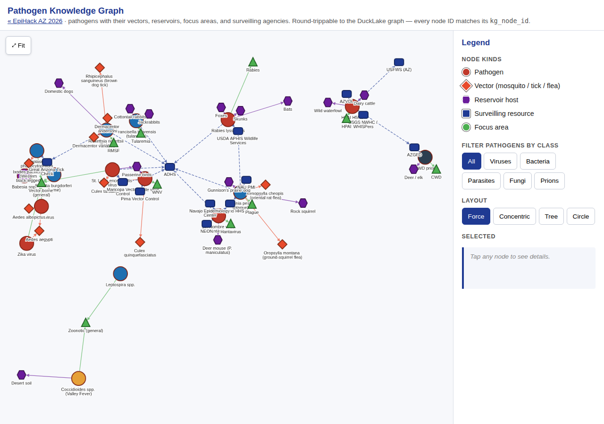

# 03 · Build the MCPs

!!! note "Source"
    [`mcp/README.md`](https://github.com/tyson-swetnam/epihack-2026/blob/main/mcp/README.md),
    [`mcp/vectorsurv-mcp/README.md`](https://github.com/tyson-swetnam/epihack-2026/blob/main/mcp/vectorsurv-mcp/README.md),
    [`plan/02-mcp-integration.md`](https://github.com/tyson-swetnam/epihack-2026/blob/main/plan/02-mcp-integration.md),
    [`agents/src/onehealth_agents/mcp_client.py`](https://github.com/tyson-swetnam/epihack-2026/blob/main/agents/src/onehealth_agents/mcp_client.py),
    and [`schema/deep/mcp_servers.sql`](https://github.com/tyson-swetnam/epihack-2026/blob/main/schema/deep/mcp_servers.sql).

## What we wanted

Eleven LLM-callable data adapters that the agent orchestrator could
dispatch on a per-prefix basis — `vectorsurv_*`, `kg_*`, `mag_*`,
`az211_*`, `gattc_*`, `nws_*`, `whispers_*`, `inat_*`, `adhs_*`,
`sms_*`, `wearable_*` — all testable offline with no upstream
credentials, and shaped uniformly enough that adding a twelfth would
be a copy-modify of an existing server rather than a fresh design.

## What we built

Eleven [FastMCP](https://github.com/jlowin/fastmcp) servers, every one
scaffolded from [`mcp/vectorsurv-mcp/`](https://github.com/tyson-swetnam/epihack-2026/tree/main/mcp/vectorsurv-mcp)
as the template. The index in
[`mcp/README.md`](https://github.com/tyson-swetnam/epihack-2026/blob/main/mcp/README.md)
is the canonical inventory; the per-server tool counts roll up to
**76 tools across 11 servers**:

| Server | Wraps | Tools | Tests |
|---|---|---:|---:|
| [vectorsurv-mcp](../mcps/vectorsurv.md) | VectorSurv mosquito + tick API (v1.0.44) | 13 | 6 |
| [knowledge-graph-mcp](../mcps/knowledge-graph.md) | DuckDB property graph + SELECT-only SQL | 12 | 22 |
| [nws-heatrisk-mcp](../mcps/nws-heatrisk.md) | NWS HeatRisk + alerts + heat-index | 7 | 17 |
| [adhs-mcp](../mcps/adhs.md) | ADHS public surveillance summaries | 6 | 46 |
| [211-az-mcp](../mcps/211-az.md) | 211 Arizona referrals + transport | 6 | 23 |
| [whispers-mcp](../mcps/whispers.md) | USGS WHISPers wildlife mortality | 6 | 15 |
| [inaturalist-mcp](../mcps/inaturalist.md) | iNaturalist citizen-science (AZ `place_id=53`) | 6 | 8 |
| [sms-entry-mcp](../mcps/sms-entry.md) | Twilio SMS intake adapter | 6 | 19 |
| [mag-hrn-mcp](../mcps/mag-hrn.md) | MAG Heat Relief Network centers | 5 | 35 |
| [great-az-tick-check-mcp](../mcps/great-az-tick-check.md) | UA Cooperative Extension tick check | 5 | 10 |
| [wearable-mcp](../mcps/wearable.md) | HealthKit / Health Connect readings | 4 | 23 |

(Tool and test counts mirror the table in [`mcp/README.md`](https://github.com/tyson-swetnam/epihack-2026/blob/main/mcp/README.md);
bumps land in the same PR that ships the change.)

Every server follows the layout enforced by the
[`mcp/README.md` "How to add a new MCP server"](https://github.com/tyson-swetnam/epihack-2026/blob/main/mcp/README.md#how-to-add-a-new-mcp-server)
section:

```
mcp/<name>-mcp/
├── README.md                    # tool table + auth posture + env vars
├── pyproject.toml               # FastMCP + httpx + pydantic v2 (own uv workspace)
├── src/<package>_mcp/
│   ├── __main__.py              # `python -m <package>` entry
│   ├── server.py                # FastMCP() + @mcp.tool definitions
│   ├── client.py                # httpx wrapper; env-overridable base URL
│   └── canned_data.py | mock_data.py   # offline fallback
├── examples/claude_desktop_config.json
└── tests/test_*.py              # uv run pytest — no network
```

The eleven servers are also encoded as graph nodes in
[`schema/deep/mcp_servers.sql`](https://github.com/tyson-swetnam/epihack-2026/blob/main/schema/deep/mcp_servers.sql)
(`mcp_server` nodes, one `mcp_tool` node per tool, with `wraps`,
`exposedBy`, `operatedBy`, and `informs` edges), so the knowledge
graph itself answers *"which MCP tools answer Heat Q1?"* in one
SQL query.

## What it looks like

The eleven servers don't have a UI of their own — they're stdio-mode
MCP processes that other agents (and Claude Code itself) call into.
The closest visible artifact is the pathogen knowledge graph rendered
by [`knowledge-graph-mcp`](../mcps/knowledge-graph.md)'s data, served
through the Cytoscape viewer at `/graph/`:



The full per-server tool inventory lives at
[MCP reference](../mcps/index.md); each server's `README.md` (now
mirrored in the docs site) documents tool signatures and example calls.

## Decisions & trade-offs

### vectorsurv-mcp is the template, on purpose

[`mcp/README.md`](https://github.com/tyson-swetnam/epihack-2026/blob/main/mcp/README.md#how-to-add-a-new-mcp-server)
points new contributors at `mcp/vectorsurv-mcp/` and says *"use it as
the template — it is the most complete reference in the family and
follows every convention reviewers expect."* That isn't aspirational
prose — every other server in `mcp/` was bootstrapped with
`cp -R vectorsurv-mcp <new>-mcp`, renamed at the package level, and
then had its `client.py` rewritten against the new upstream. The
result is that all eleven servers share the same file layout, the
same `httpx` + `pydantic v2` plumbing, the same `__main__.py` entry,
and the same offline-by-default test pattern. A contributor who
learns one server learns ten more for free.

The trade-off: when `vectorsurv-mcp` evolves (it gained the
streamable-HTTP / Claude.ai custom-connector path in commit
`e4c6a64`), the other ten don't automatically inherit the new
capability. That's a known follow-up (see below), not a hidden
liability — the inheritance is by convention, not by code.

### Per-server tool prefixes are load-bearing

The naming rule is at the top of the
[`mcp/README.md` conventions list](https://github.com/tyson-swetnam/epihack-2026/blob/main/mcp/README.md#2-conventions-reviewers-will-check):
*prefix every tool name with a short server prefix* —
`vectorsurv_`, `kg_`, `mag_`, `az211_`, `gattc_`, `nws_`,
`whispers_`, `inat_`, `adhs_`, `sms_`, `wearable_`. It's not
cosmetic. The orchestrator in
[`agents/src/onehealth_agents/mcp_client.py`](https://github.com/tyson-swetnam/epihack-2026/blob/main/agents/src/onehealth_agents/mcp_client.py)
dispatches every call as `client.call_tool(server, tool, **kwargs)`,
where the `(server, tool)` tuple is the registry key
([`mcp_client.py` lines 56-69](https://github.com/tyson-swetnam/epihack-2026/blob/main/agents/src/onehealth_agents/mcp_client.py#L56-L69)).
A bare `get_pools` lookup would silently match the wrong server
once two MCPs ship a `get_pools` tool; prefixed
`vectorsurv_get_pools` and `whispers_events_bbox` can't collide by
construction.

!!! warning "Collisions silently break Scenarios A / C / D"
    The four worked data flows in
    [`plan/04-data-flows.md`](https://github.com/tyson-swetnam/epihack-2026/blob/main/plan/04-data-flows.md)
    each chain three or four MCP calls. A tool-name collision wouldn't
    fail loud — it would just dispatch to the wrong handler and return
    a structurally valid response. The prefix rule is the cheapest
    way to make that class of bug impossible.

### Tests must pass offline — every server ships `canned_data.py`

[`mcp/README.md` convention 3](https://github.com/tyson-swetnam/epihack-2026/blob/main/mcp/README.md#2-conventions-reviewers-will-check):
*"Tests must run with no network. Put canned data in a sibling
module (`canned_data.py` / `mock_data.py`) and silently fall back on
connection errors."* Combined with the
[`CLAUDE.md` lint section](https://github.com/tyson-swetnam/epihack-2026/blob/main/CLAUDE.md#lint--format)
rule that *"tests must not hit the network — use the per-server
`canned_data.py` / `mock_data.py` or `respx`"*, this gives every
server a deterministic offline mode. `whispers-mcp`,
`mag-hrn-mcp`, and `adhs-mcp` ship sizeable canned datasets (a
12-site Phoenix HRN registry, ADHS PDF transcriptions, USGS
WHISPers snapshots) and silently fall back to them when the
upstream is unreachable. The orchestrator's
[`FakeMCPClient.with_default_handlers()`](https://github.com/tyson-swetnam/epihack-2026/blob/main/agents/src/onehealth_agents/mcp_client.py#L74-L226)
extends the same pattern to the eight-agent test suite: every
Scenario A / C tool call has a canned response registered, so
`uv run pytest` inside `agents/` finishes in seconds with no
sockets opened.

### The `kg_sql` escape hatch is SELECT-only by parser, not by convention

`knowledge-graph-mcp` ships an `kg_sql` tool for *"arbitrary
read-only SELECT against the kg schema"* — the escape hatch an LLM
needs when none of the 11 typed kg-tools answers the question.
Letting an LLM run arbitrary SQL against a lakehouse would
ordinarily be a foot-gun; here it's enforced by
[`assert_select_only()`](https://github.com/tyson-swetnam/epihack-2026/blob/main/mcp/knowledge-graph-mcp/src/knowledge_graph_mcp/queries.py#L355-L366):

- The query must match `^\s*(?:select|with)\b` (single statement).
- A `_FORBIDDEN_RE` blocks `insert | update | delete | drop | alter
  | create | attach | detach | copy | truncate | grant | revoke |
  pragma | export | import | call | use | set | reset | vacuum |
  analyze | begin | commit | rollback | checkpoint | install |
  load` ([`queries.py` lines 343-348](https://github.com/tyson-swetnam/epihack-2026/blob/main/mcp/knowledge-graph-mcp/src/knowledge_graph_mcp/queries.py#L343-L348)).
- Multi-statement payloads (`;` inside the trimmed query) are
  rejected.
- The accepted SELECT is wrapped as `SELECT * FROM (<safe>) _kg_inner
  LIMIT <SQL_ROW_CAP>` so even a runaway query can't return more than
  the row cap.

[`CLAUDE.md`](https://github.com/tyson-swetnam/epihack-2026/blob/main/CLAUDE.md)
is explicit: *"The `kg_sql` escape hatch in `knowledge-graph-mcp` is
SELECT-only by parser, not by convention. Don't weaken that filter."*

### Mock-by-default where the upstream has no public API

Three servers proxy data sources that don't have a public REST API
today: `great-az-tick-check-mcp` (UA Cooperative Extension), `adhs-mcp`
(ADHS publishes PDFs and ArcGIS dashboards, not JSON), and parts of
`mag-hrn-mcp` (the supply-status feed is mock-only until MAG ships
occupancy data). The
[`mcp/README.md` index](https://github.com/tyson-swetnam/epihack-2026/blob/main/mcp/README.md#index)
column for those rows reads *"Optional `…_API_TOKEN` for a future
real backend; defaults to mock-mode (no auth)"*. The
[mock-by-default convention](https://github.com/tyson-swetnam/epihack-2026/blob/main/mcp/README.md#2-conventions-reviewers-will-check)
also requires the FastMCP tool docstring to declare the mock
posture so an LLM doesn't surface mock data as authoritative.

### Claude.ai custom-connector path is shipped on one server, not all

`vectorsurv-mcp` runs over **streamable-HTTP** behind nginx as a
**Claude.ai custom connector** at
`https://epihack-test.cis240692.projects.jetstream-cloud.org/mcp/vectorsurv`
(the runbook is in
[`mcp/vectorsurv-mcp/README.md`](https://github.com/tyson-swetnam/epihack-2026/blob/main/mcp/vectorsurv-mcp/README.md#as-a-claudeai-custom-connector-remote-mcp-hosted-on-this-vm)).
The pattern is:

1. Run the server with `MCP_TRANSPORT=streamable-http`, bind to
   `127.0.0.1:801N`, set `FASTMCP_STREAMABLE_HTTP_PATH=/mcp/<name>`
   so nginx can pass the URI through unchanged.
2. Add one `location /mcp/<name>` block to the ansible-rendered
   nginx config, with `proxy_buffering off` and
   `proxy_read_timeout 3600s` to hold the SSE channel open.
3. Register the HTTPS URL in Claude.ai's Connectors UI.

The other ten servers are still **stdio-only** — they work fine as
Claude Desktop / Claude Code / Cursor / Codex MCPs (their
`examples/claude_desktop_config.json` snippets are exact), but
they don't yet have an HTTPS-fronted remote connector. That's the
biggest known follow-up: the `mcp_http_servers` list in
[`ansible/group_vars/all.yml`](https://github.com/tyson-swetnam/epihack-2026/blob/main/ansible/group_vars/all.yml)
already accepts more entries, and the nginx role renders one
`location` per entry — what's missing is the `FASTMCP_*` env
configuration in each server's systemd unit and a fresh round of
streamable-HTTP testing for the other ten.

!!! tip "Why ship the connector path on one server first"
    The first connector exposed three deploy-side gaps — the
    `FASTMCP_STREAMABLE_HTTP_PATH` requirement, the nginx
    `proxy_buffering off` need, and an `Authorization` header
    interaction that commit
    [`199bcfc`](https://github.com/tyson-swetnam/epihack-2026/commit/199bcfc)
    fixed for `vectorsurv-mcp` and `nws-heatrisk-mcp`. Better to
    catch those on one server than on eleven.

### MCP boundary = auth boundary

VectorSurv requires a Gateway account; the bearer JWT is held in
the MCP server process and **never** sent to the LLM
([`plan/02-mcp-integration.md`](https://github.com/tyson-swetnam/epihack-2026/blob/main/plan/02-mcp-integration.md#auth--data-sovereignty-notes)).
The same posture applies to every authenticated upstream — the
`.env` file lives next to the server, the LLM client receives only
the parsed response. Tribal-data MCPs also carry a sunset clause
(`pyproject.toml` `description` + a `MOU_RENEWED_THROUGH` env
refusal in `__main__.py`) per
[`GOVERNANCE.md`](https://github.com/tyson-swetnam/epihack-2026/blob/main/GOVERNANCE.md);
no tribal-data server ships today, but the contract is in place.

## Where to go next

[04 · Stand up the store →](04-store.md)
