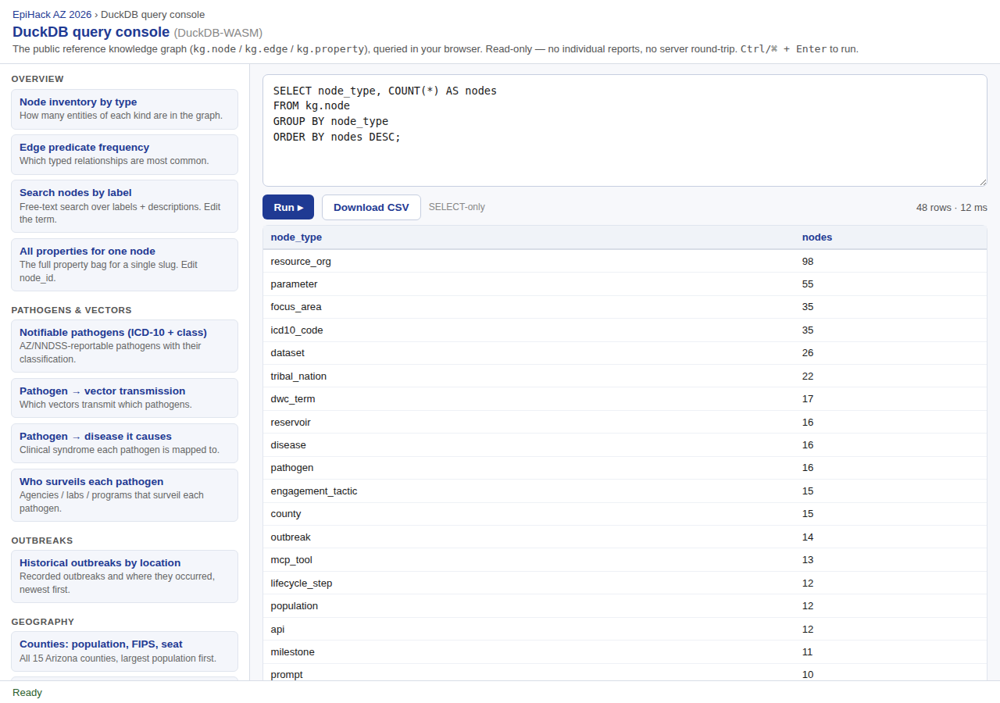
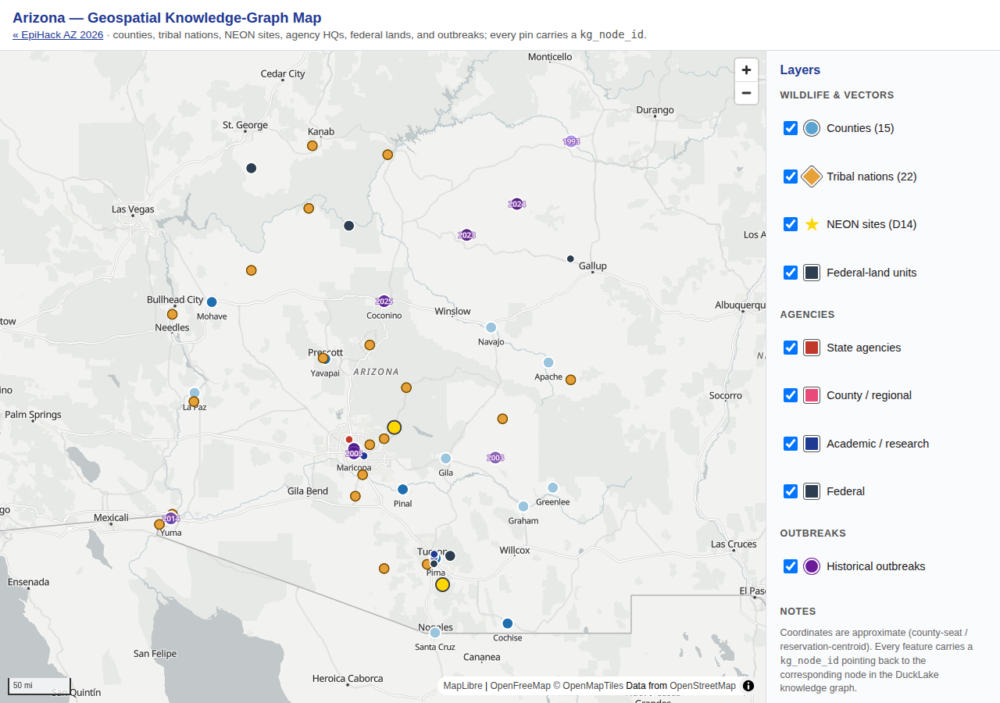

# 04 · Stand up the store

!!! note "Source"
    [`plan/09-mobile-datastore.md`](https://github.com/tyson-swetnam/epihack-2026/blob/main/plan/09-mobile-datastore.md),
    [`schema/knowledge_graph.sql`](https://github.com/tyson-swetnam/epihack-2026/blob/main/schema/knowledge_graph.sql),
    [`schema/deep/*.sql`](https://github.com/tyson-swetnam/epihack-2026/tree/main/schema/deep),
    [`agents/src/onehealth_agents/kg_writer.py`](https://github.com/tyson-swetnam/epihack-2026/blob/main/agents/src/onehealth_agents/kg_writer.py),
    [`agents/src/onehealth_agents/mongo_writer.py`](https://github.com/tyson-swetnam/epihack-2026/blob/main/agents/src/onehealth_agents/mongo_writer.py),
    and [`ansible/roles/ducklake/files/bootstrap_ducklake.py`](https://github.com/tyson-swetnam/epihack-2026/blob/main/ansible/roles/ducklake/files/bootstrap_ducklake.py).

## What we wanted

A single source of truth for the knowledge graph, queryable both from
inside the agents (server-side) and from the browser (client-side, via
DuckDB-WASM) — and, once the mobile build became real on
**2026-05-20**, a write path that could absorb a flexible mobile
payload without sacrificing the analytical power of the lakehouse. The
non-negotiable was that the
[privacy contract](../architecture/privacy.md) — coarsen location,
strip EXIF GPS, never-diagnose, SHA-256 audit digests — had to be
enforced in **one** place, regardless of which sink ended up holding
the row.

## What we built

A **dual-sink datastore** with one ingress and one privacy
enforcement point:

- **DuckLake-on-Postgres** for web + analytics: Postgres holds the
  lakehouse catalog (time-travel, snapshots, ACID); DuckDB is the
  query engine; data lives as Parquet in a local data path (or
  S3). Bootstrapped by
  [`ansible/roles/ducklake/files/bootstrap_ducklake.py`](https://github.com/tyson-swetnam/epihack-2026/blob/main/ansible/roles/ducklake/files/bootstrap_ducklake.py).
- **MongoDB Community** for mobile writes, self-hosted on the same
  VM, bound to `127.0.0.1`, auth on. Wired by the `mongodb` ansible
  role added in plan/09 Phase B.
- An **`X-Client-Channel: mobile | web`** request header on
  `POST /v1/reports` selects the sink — *after* the shared privacy
  enforcement runs, so the contract lives in
  [`agents/.../api/routes/reports.py`](https://github.com/tyson-swetnam/epihack-2026/blob/main/agents/src/onehealth_agents/api/routes/reports.py)
  in exactly one place.
- A **`mongo_to_ducklake` watermarked, idempotent ETL** runs every
  five minutes as a systemd timer, replaying new Mongo documents
  into DuckLake via
  [`KgWriter.persist_synced_observation()`](https://github.com/tyson-swetnam/epihack-2026/blob/main/agents/src/onehealth_agents/kg_writer.py#L200-L276)
  so the agents, MCP servers, and cluster detection see one
  unified dataset.
- A **DuckDB-WASM in-browser query console** at
  [`query/`](https://github.com/tyson-swetnam/epihack-2026/tree/main/query)
  (also reachable from the app at `app/src/app/duckdb/`), pulling
  DuckDB-WASM from a pinned unpkg URL — same rule as the
  MapLibre / Cytoscape pinning in `map/` and `graph/`.

The graph itself is property-graph–shaped, defined in
[`schema/knowledge_graph.sql`](https://github.com/tyson-swetnam/epihack-2026/blob/main/schema/knowledge_graph.sql#L32-L65)
as three tables:

| Table | Holds | Primary key |
|---|---|---|
| `kg.node` | every concept — pathogen, county, tribe, parameter, milestone, MCP server, observation, … | `node_id` (stable dot-namespaced slug) |
| `kg.edge` | typed relationships — `belongsTo`, `precedes`, `wraps`, `informs`, `hasMilestone`, … | `edge_id` (BIGINT in a contiguous per-seed range) |
| `kg.property` | the free-form attribute bag, with `value_text` for strings/enums and `value_num` for ordinals/counts | `(node_id, key)` |

At archive freeze (2026-05-23), the graph contains **572 nodes /
791 edges / 1,027 properties** — counts surfaced by
[`mcp/README.md`](https://github.com/tyson-swetnam/epihack-2026/blob/main/mcp/README.md#index)
and reachable from any client through `knowledge-graph-mcp`.

## What it looks like

The same kg.* tables `knowledge-graph-mcp` queries server-side are
also queryable client-side through DuckDB-WASM at `/query/` — a
browser-only console with sixteen pre-written queries plus a
SELECT-only editor and CSV export:

And the live map at `/map/` is the geographic projection of the same
graph: every pin links back to its `kg_node_id`, so the map and the
graph viewer share a single source of truth:

## Decisions & trade-offs

### DuckLake-on-Postgres over Iceberg, over plain DuckDB

The
[`README.md` "Why DuckLake + DuckDB + Postgres"](https://github.com/tyson-swetnam/epihack-2026/blob/main/README.md#why-ducklake--duckdb--postgres)
table is the short version: Postgres is the lakehouse catalog
(snapshots, schema evolution, ACID); DuckLake is the open
lakehouse format on Parquet *with* the catalog in Postgres;
DuckDB is the embedded query engine that reads/writes DuckLake
natively and can join Parquet + Postgres + CSV in one statement.
Iceberg would have meant a metastore (Hive, Glue, or Nessie), a
separate write engine, and a third process to babysit on a
Jetstream2 VM under one ansible playbook — the wrong shape for
this codebase. Plain DuckDB on its own was ruled out because the
agents, the ansible deploy, and the mongo→ducklake sync all need
a shared catalog that survives restarts and tolerates concurrent
writers; a single `epihack.duckdb` file ticks none of those
boxes. The win of DuckLake-on-Postgres is that the same engine
runs in the agents
([`KgWriter`](https://github.com/tyson-swetnam/epihack-2026/blob/main/agents/src/onehealth_agents/kg_writer.py#L80-L101)),
in `knowledge-graph-mcp`, in the analyst dashboard, and in the
browser via DuckDB-WASM — *without a translation layer between
them*.

### Three tables, not fifty

A "real" surveillance schema would have a `pathogen` table, a
`vector` table, a `county` table, a `tribe` table, an
`mcp_server` table, an `observation` table, and twenty join
tables. The kg schema collapses all of that into
`kg.node` + `kg.edge` + `kg.property`
([`schema/knowledge_graph.sql` lines 32-65](https://github.com/tyson-swetnam/epihack-2026/blob/main/schema/knowledge_graph.sql#L32-L65)).
The trade-off is real:

- **Loses:** column-level types per entity, schema-enforced
  per-table constraints, narrow indexes.
- **Wins:** every new concept lands as a `INSERT INTO kg.node`
  and an `INSERT INTO kg.edge` — no migration, no new SQL file,
  no new MCP tool. The 16 pathogens, 15 counties, 22 federally
  recognized tribes, 11 MCP servers, eight Figure-2 parameter
  classes, eleven Figure-3 milestones, and twelve Figure-4
  lifecycle steps live in **the same three tables**. That's
  why `knowledge-graph-mcp` can ship 12 generic tools instead of
  a per-entity tool family.

The cost-tracking lives in `kg.property` as `(node_id, key,
value_text | value_num)` triples, which is enough for the
ordinal / freshness / jurisdiction / URL properties the seeds
populate.

### Dot-namespaced slugs are the join key everywhere

Every node carries a stable slug like `pathogen.west_nile`,
`county.maricopa`, `mcp.vectorsurv`, `milestone.detect`.
[`CLAUDE.md`](https://github.com/tyson-swetnam/epihack-2026/blob/main/CLAUDE.md#architectural-rules-that-span-multiple-files)
is explicit: *"Every knowledge-graph node has a stable
dot-namespaced slug. Renames cascade through `agents/`,
dashboards, and map/graph viewers. Coordinate in the PR."* This
matters because:

- Every MapLibre pin in
  [`map/`](https://github.com/tyson-swetnam/epihack-2026/tree/main/map)
  and every Cytoscape node in
  [`graph/`](https://github.com/tyson-swetnam/epihack-2026/tree/main/graph)
  carries the slug as `kg_node_id` — click any feature and it
  round-trips to a `SELECT` on `kg.node`.
- The agents' `FakeMCPClient` returns slugs as IDs in canned
  responses
  ([`mcp_client.py` lines 78-101](https://github.com/tyson-swetnam/epihack-2026/blob/main/agents/src/onehealth_agents/mcp_client.py#L78-L101)):
  Patagonia → `county.santa_cruz`, downtown Phoenix →
  `county.maricopa`.
- Slug collisions across seeds are the bug class the
  `plan/EXECUTION-STATUS-*` follow-up list tracks; the namespacing
  (`pathogen.`, `county.`, `mcp.`, `param.`) is the cheapest way to
  prevent them.

### Mongo for mobile, DuckLake for web — decided 2026-05-20

The split is recorded in
[`plan/09-mobile-datastore.md`](https://github.com/tyson-swetnam/epihack-2026/blob/main/plan/09-mobile-datastore.md):
*"the mobile app persists reports to MongoDB; the hosted website
and the analytics/knowledge-graph backend stay on DuckLake. Both
write paths go through FastAPI, so the privacy contract stays
enforced in one place."* The reasoning is operational separation
(a flexible document store for an evolving mobile payload,
decoupled from the analytical lakehouse) plus a single
enforcement point: validation, coarsening, EXIF check,
triage-output guard, and audit digest all run *before* the sink
is chosen by the `X-Client-Channel` header. The mobile sink
([`MongoWriter.persist_observation()`](https://github.com/tyson-swetnam/epihack-2026/blob/main/agents/src/onehealth_agents/mongo_writer.py#L64-L99))
and the web sink
([`KgWriter.persist_observation()`](https://github.com/tyson-swetnam/epihack-2026/blob/main/agents/src/onehealth_agents/kg_writer.py#L103-L198))
receive an already-validated payload; SHA-256 digests of `notes`
and `claim_token` are computed identically in both writers; and
the mongo→ducklake sync replays mobile documents so the analyst
dashboard, cluster detector, and `knowledge-graph-mcp` see one
dataset. The
[`X-Client-Channel`](https://github.com/tyson-swetnam/epihack-2026/blob/main/agents/src/onehealth_agents/api/routes/reports.py)
header default is `web`; the Capacitor build sets `mobile`; the
header is documented in `api/openapi.yaml` (spec-first, per
[`CLAUDE.md`](https://github.com/tyson-swetnam/epihack-2026/blob/main/CLAUDE.md#architectural-rules-that-span-multiple-files)).

### Five-minute sync, not change streams (yet)

[`plan/09` Phase C](https://github.com/tyson-swetnam/epihack-2026/blob/main/plan/09-mobile-datastore.md#phases)
ships **`mongo_to_ducklake.py`** as a watermarked, idempotent ETL
driven by a systemd timer
(`onehealth-mongo-sync.timer`, every five minutes), not a
MongoDB change-stream consumer. The trade-off is explicit:

- **Wins:** simpler ops, deterministic batches, easy to back-fill
  by clearing the watermark.
- **Loses:** sub-minute freshness in DuckLake for mobile reports.

[`persist_synced_observation()`](https://github.com/tyson-swetnam/epihack-2026/blob/main/agents/src/onehealth_agents/kg_writer.py#L200-L276)
is idempotent on `observation_id`: it probes `kg.node` for the
ID first and short-circuits if it exists, so re-running the
sync is safe. The audit row carries `agent_name = 'mongo-sync'`
so the analytics layer can attribute synced rows back to the
mobile channel. A change-stream upgrade is the documented
"lower-latency upgrade path later"
([`plan/09` line 67-68](https://github.com/tyson-swetnam/epihack-2026/blob/main/plan/09-mobile-datastore.md#hosting--sync--recommendation-youll-confirm)),
not a blocker.

### DuckDB-WASM in the browser as a third surface

Beyond the agents (server-side DuckDB) and the dashboards
(server-side DuckDB through `knowledge-graph-mcp`), the same
parquet files are queryable in the browser via DuckDB-WASM at
[`query/`](https://github.com/tyson-swetnam/epihack-2026/tree/main/query).
It's a static page (no bundler, ES modules from a pinned unpkg
URL) with a SQL window and a set of pre-written queries — same
engine, same SQL, same data, no server round-trip. The
conscious trade-off: anything queried from the browser is
public-facing, so the WASM surface gets only **aggregated** views
(ZCTA-bucketed counts via
[`aggregate_by_zcta()`](https://github.com/tyson-swetnam/epihack-2026/blob/main/agents/src/onehealth_agents/kg_writer.py#L434-L466),
with small-cell suppression and withdrawn-row filtering) and
never raw `observation` nodes. Privacy rule 6 in
[`CLAUDE.md`](https://github.com/tyson-swetnam/epihack-2026/blob/main/CLAUDE.md#privacy-contract-load-bearing--enforced-in-code-not-just-docs)
— *"Cluster output uses ZCTA-week / ZCTA-2h aggregations, never
individual observations"* — is the gate.

### Seed load order is `standards.sql` and `pathogens.sql` first

The bootstrap recipe in
[`CLAUDE.md`](https://github.com/tyson-swetnam/epihack-2026/blob/main/CLAUDE.md#knowledge-graph-bootstrap)
and
[`README.md`](https://github.com/tyson-swetnam/epihack-2026/blob/main/README.md#bootstrap)
both load
[`schema/deep/standards.sql`](https://github.com/tyson-swetnam/epihack-2026/blob/main/schema/deep/standards.sql)
and
[`schema/deep/pathogens.sql`](https://github.com/tyson-swetnam/epihack-2026/blob/main/schema/deep/pathogens.sql)
**before** every other `schema/deep/*.sql` file. The reason is
referential:

- `standards.sql` ships SNOMED CT / ICD-10 / Darwin Core nodes
  that downstream symptom + lab nodes reference.
- `pathogens.sql` ships the pathogen / vector / reservoir nodes
  that the outbreak, county, tribe, and follow-up seeds attach
  edges to.

The
[`bootstrap_ducklake.py` loader](https://github.com/tyson-swetnam/epihack-2026/blob/main/ansible/roles/ducklake/files/bootstrap_ducklake.py#L38-L50)
honours this by delegating to `knowledge_graph_mcp.loader.
discover_schema_files()` first, with an inline fallback that
explicitly promotes `standards.sql` and `pathogens.sql` to the
front of the deep list. Get the order wrong and downstream seeds
fail with foreign-key errors on the in-memory replay step.

!!! warning "DuckLake doesn't enforce PK / UNIQUE / FK"
    [`bootstrap_ducklake.py`](https://github.com/tyson-swetnam/epihack-2026/blob/main/ansible/roles/ducklake/files/bootstrap_ducklake.py#L8-L18)
    replays the full schema into an **in-memory DuckDB** (where
    constraints work), then `CREATE TABLE … AS SELECT *`–copies
    every base table into DuckLake (constraints drop on CTAS).
    The data is identical; the constraint-checking happens once,
    in memory, before anything lands in the lakehouse.

### Edge-ID ranges are allocated per seed file

Each `schema/deep/*.sql` seed owns a contiguous edge-ID range
documented in the file header. The actual allocations:

| Seed | Range |
|---|---|
| [`pathogens.sql`](https://github.com/tyson-swetnam/epihack-2026/blob/main/schema/deep/pathogens.sql#L39) | 10000-10999 |
| [`tribes.sql`](https://github.com/tyson-swetnam/epihack-2026/blob/main/schema/deep/tribes.sql#L11) | 11000-11999 |
| [`counties.sql`](https://github.com/tyson-swetnam/epihack-2026/blob/main/schema/deep/counties.sql#L14) | 12000-12999 |
| [`datasets_apis.sql`](https://github.com/tyson-swetnam/epihack-2026/blob/main/schema/deep/datasets_apis.sql#L14) | 13000-13999 |
| [`outbreaks.sql`](https://github.com/tyson-swetnam/epihack-2026/blob/main/schema/deep/outbreaks.sql#L18) | 14000-14999 |
| [`standards.sql`](https://github.com/tyson-swetnam/epihack-2026/blob/main/schema/deep/standards.sql#L17) | 15000-15999 |
| [`mcp_servers.sql`](https://github.com/tyson-swetnam/epihack-2026/blob/main/schema/deep/mcp_servers.sql) | 16000-16999 |
| [`application.sql`](https://github.com/tyson-swetnam/epihack-2026/blob/main/schema/deep/application.sql#L45) | 20000-20999 |

The convention is in
[`CLAUDE.md`](https://github.com/tyson-swetnam/epihack-2026/blob/main/CLAUDE.md#architectural-rules-that-span-multiple-files):
*"New seeds: pick the next free range, document in the PR."*
The motive is two-fold — `ON CONFLICT DO NOTHING` makes
re-running a seed idempotent, *and* the contiguous ranges let
a reader open `kg.edge` sorted by `edge_id` and see exactly
which seed produced which relationship.

## Where to go next

[05 · Orchestrate the agents →](05-orchestrate.md)
