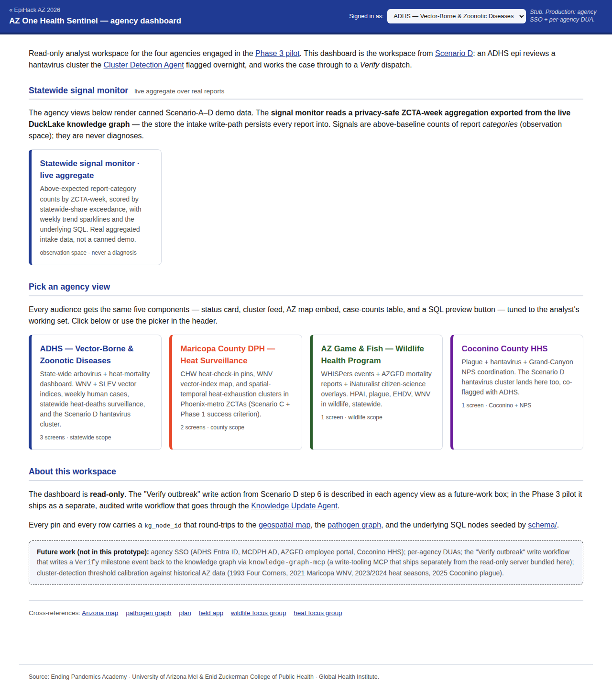
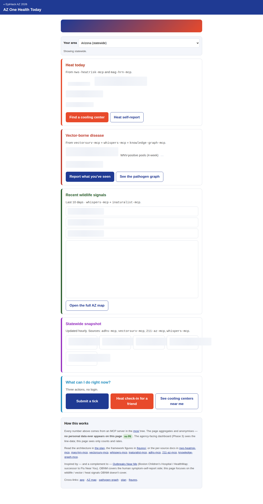

# 05 · Orchestrate the agents

!!! info "Source"
    [`plan/03-agentic-architecture.md`](https://github.com/tyson-swetnam/epihack-2026/blob/main/plan/03-agentic-architecture.md),
    [`plan/04-data-flows.md`](https://github.com/tyson-swetnam/epihack-2026/blob/main/plan/04-data-flows.md),
    and the eight agents under
    [`agents/src/onehealth_agents/`](https://github.com/tyson-swetnam/epihack-2026/blob/main/agents/src/onehealth_agents/).

## What we wanted

A pipeline that turns one anonymous mobile report into a triage decision,
a knowledge-graph write, and (when appropriate) an agency notification —
without ever diagnosing the user, ever logging a raw observation, and ever
letting a precise latitude or longitude touch a persisted row. Eight
agents, narrow contracts, no shared state, the whole thing testable
offline.

## What we built

Eight Pydantic v2 agents wired into a single async pipeline. Each agent
is one file under
[`agents/src/onehealth_agents/`](https://github.com/tyson-swetnam/epihack-2026/blob/main/agents/src/onehealth_agents/);
the typed messages they pass back and forth live in
[`contracts.py`](https://github.com/tyson-swetnam/epihack-2026/blob/main/agents/src/onehealth_agents/contracts.py).

| # | Agent | File | What it does |
|---|---|---|---|
| 1 | **IntakeAgent** | [`intake.py`](https://github.com/tyson-swetnam/epihack-2026/blob/main/agents/src/onehealth_agents/intake.py) | Free text / voice / structured form → Minimum-Dataset draft; picks the `Vertical` (vbd / heat / both / neither) and the `ConsentProfile`. |
| 2 | **GeoEnrichmentAgent** | [`geo.py`](https://github.com/tyson-swetnam/epihack-2026/blob/main/agents/src/onehealth_agents/geo.py) | Calls `knowledge-graph-mcp.kg_regions_at_point`; resolves coords → `county.*` / `tribe.*` / `region.*` slugs, with a tiny in-process ZCTA fallback. |
| 3 | **ValidationAgent** | [`validation.py`](https://github.com/tyson-swetnam/epihack-2026/blob/main/agents/src/onehealth_agents/validation.py) | Dedupe, AZ bounding-box sanity, consent-profile field suppression, tribal-MOU enforcement. The single enforcement point for the privacy contract. |
| 4 | **TriageAgent** | [`triage.py`](https://github.com/tyson-swetnam/epihack-2026/blob/main/agents/src/onehealth_agents/triage.py) | Vertical-specific dispatch (`HeatTriage` / `VBDTriage`). Emits a `TriageDecision` whose `triage_class` is constrained to the `tc.*` enum subset for that vertical. |
| 5 | **EnrichmentAgent** | [`enrichment.py`](https://github.com/tyson-swetnam/epihack-2026/blob/main/agents/src/onehealth_agents/enrichment.py) | Vertical- and triage-class-conditioned MCP fan-out: VectorSurv pools, NWS HeatRisk, MAG HRN cooling centers, 211 transport, WHISPers wildlife mortality, iNaturalist nearby observations, the Great AZ Tick Check mail-in. |
| 6 | **NotificationAgent** | [`notification.py`](https://github.com/tyson-swetnam/epihack-2026/blob/main/agents/src/onehealth_agents/notification.py) | Picks audience (`user` / `chw` / `agency_analyst`), channel, locale; user-first except for `tc.call_911`, where the agency dispatch ordering inverts. |
| 7 | **ClusterDetectionAgent** | [`cluster.py`](https://github.com/tyson-swetnam/epihack-2026/blob/main/agents/src/onehealth_agents/cluster.py) | Async, runs over the buffered observation list — ZCTA-week and ZCTA-2h Poisson scans, a Gamma-Poisson posterior on top, plus Tier-A single-case, Tier-B county-week, Tier-C chronic-drift, and travel-import detectors. Calibrated against AZ outbreak history in [`plan/CLUSTER-CALIBRATION.md`](https://github.com/tyson-swetnam/epihack-2026/blob/main/plan/CLUSTER-CALIBRATION.md). |
| 8 | **KnowledgeUpdateAgent** | [`update.py`](https://github.com/tyson-swetnam/epihack-2026/blob/main/agents/src/onehealth_agents/update.py) | Nightly + on-demand MCP pull; reshapes upstream rows into `Kind.MCP_PULL` observations so they round-trip through the same write path. |

The pipeline itself is
[`orchestrator.py`](https://github.com/tyson-swetnam/epihack-2026/blob/main/agents/src/onehealth_agents/orchestrator.py) —
about 300 lines, mostly `try` / `except` boundaries so a failing agent
degrades to `AgentRun.status='failed'` plus a flag on the observation
and never drops the whole report. Agents 1–6 run synchronously per
report (`Orchestrator.process(raw) -> Observation`); the Cluster
Detection Agent and the Knowledge Update Agent are async / nightly via
`Orchestrator.detect_clusters` and `Orchestrator.refresh_from_mcp`.

The per-agent default model assignment lives in `_DEFAULT_MODEL_FOR_AGENT`
at the top of the orchestrator — **Haiku** on the high-volume Intake /
Geo / Validation / Notification / Update steps, **Sonnet** on Triage and
Enrichment, **Opus** only on Cluster Detection. The cost-shaping is
documented in [`plan/03`](https://github.com/tyson-swetnam/epihack-2026/blob/main/plan/03-agentic-architecture.md)
and [`plan/05`](https://github.com/tyson-swetnam/epihack-2026/blob/main/plan/05-roadmap.md).

### The privacy contract (encoded, not just documented)

Six rules — and where each one is enforced — from
[`docs/architecture/privacy.md`](../architecture/privacy.md):

1. **No precise lat/lon over the wire.** The `CoarseLocation` schema in
   [`api/openapi.yaml`](https://github.com/tyson-swetnam/epihack-2026/blob/main/api/openapi.yaml)
   accepts `zip` (5-digit) or `grid_id` (`g1km:…` pattern) only; the
   client coarsens via
   [`app/src/lib/coarse-geo.ts`](https://github.com/tyson-swetnam/epihack-2026/blob/main/app/src/lib/coarse-geo.ts);
   the ValidationAgent re-runs the AZ bounding-box check before
   persisting.
2. **EXIF GPS stripped before upload.** The client canvas re-encode in
   [`app/src/lib/exif-stripper.ts`](https://github.com/tyson-swetnam/epihack-2026/blob/main/app/src/lib/exif-stripper.ts)
   strips first; the FastAPI route in
   [`agents/.../api/routes/reports.py`](https://github.com/tyson-swetnam/epihack-2026/blob/main/agents/src/onehealth_agents/api/routes/reports.py)
   rejects with `photo_exif_gps_present` (422) if anything slips through.
3. **Tribal data is suppressed by default.** `ValidationAgent` consults
   the in-process `_TRIBAL_MOU_ACTIVE` set: an empty default means *every*
   tribal observation has row-level identifiers blanked and coordinates
   coarsened to the county centroid before any downstream sharing. An
   operator populates that set at deployment from an out-of-band list of
   signed agreements.
4. **Triage is routing, not diagnosis.** Every `TriageDecision` is
   constrained to the closed `tc.*` enum
   ([`contracts.py`](https://github.com/tyson-swetnam/epihack-2026/blob/main/agents/src/onehealth_agents/contracts.py),
   `TriageClass`); the LLM branch is gated by `VBD_TRIAGE_CLASSES` /
   `HEAT_TRIAGE_CLASSES` frozensets, with an `assert` in `triage.py` that
   fires if either branch tries to escape its enumeration. A
   server-side regex output-guard rejects `you have …` / `you may have …`
   / `diagnos*` copy from any free-text agent output before it reaches
   the client.
5. **Audit log stores SHA-256 digests, never raw observations.** Every
   `AgentRun` carries `input_digest` and `output_digest` —
   [`audit.py`](https://github.com/tyson-swetnam/epihack-2026/blob/main/agents/src/onehealth_agents/audit.py)
   canonicalises the payload (`json.dumps(..., sort_keys=True,
   separators=(",", ":"))`) and writes only the sha256 hex digest into
   `kg.agent_run`. No PII or symptom payload survives in the audit row.
6. **Cluster output uses ZCTA-week / ZCTA-2h aggregations**, never
   individual observations. The Cluster Detection Agent's spatial scan
   buckets on `(zcta, iso_week)` for VBD and `(zcta, 2h)` for Heat
   in-season; its alerts carry `observation_ids` for the audit trail but
   the public-facing detector output is the bucket-level
   `expected`/`observed` count and the Tier-2 posterior, not the
   underlying rows.

The PR checklist at the bottom of
[`CONTRIBUTING.md`](https://github.com/tyson-swetnam/epihack-2026/blob/main/CONTRIBUTING.md)
is what gates changes to any of the above — review board members
explicitly walk the six rules before merging anything that touches
`agents/`, `mcp/<server>/`, or `schema/deep/*.sql`.

### The four worked scenarios

[`plan/04-data-flows.md`](https://github.com/tyson-swetnam/epihack-2026/blob/main/plan/04-data-flows.md)
fixes four end-to-end scenarios. Scenarios A and C are committed as
runnable Python under
[`agents/examples/`](https://github.com/tyson-swetnam/epihack-2026/blob/main/agents/examples/);
B and D are documented data flows that the same orchestrator already
supports through the existing tool inventory.

- **Scenario A — hiker mails in a tick** ([`scenario_a_tick.py`](https://github.com/tyson-swetnam/epihack-2026/blob/main/agents/examples/scenario_a_tick.py)).
  Mobile / VBD / Patagonia. IntakeAgent fixes vertical=`vbd` and
  consent=`tick_mailin`; GeoEnrichmentAgent resolves the 31.541,
  -110.755 GPS to `county.santa_cruz` / `region.border_corridor`;
  TriageAgent picks `tc.mail_to_walker_lab` with a 14-day
  self-monitor secondary action; EnrichmentAgent calls
  `gattc_create_submission` for the mailing label PDF and
  `vectorsurv_get_pools` for nearby positivity; NotificationAgent
  ships the user a mailing-label card.
- **Scenario B — symptomatic patient calls 211**. Voice channel,
  Phoenix construction worker, fevers + muscle aches. The triage
  rule layer surfaces WNV, dengue, and leptospirosis as candidate
  pathogens; the enrichment step calls `vectorsurv_get_pools` for
  WNV pool positivity and `adhs_recent_cases` for a Maricopa
  uptick; triage class lands on `tc.urgent_care`. Worker, 211
  operator, and the MCDPH agency dashboard all get differently-
  shaped notifications.
- **Scenario C — unsheltered resident heat check-in**
  ([`scenario_c_heat.py`](https://github.com/tyson-swetnam/epihack-2026/blob/main/agents/examples/scenario_c_heat.py)).
  CHW tablet / Heat / downtown Phoenix on a Magenta-HeatRisk day.
  IntakeAgent applies the anonymous-heat consent profile and
  blanks email/phone/occupation. HeatTriage scores the
  vulnerability components — unsheltered (+3), outdoor exposure
  (+2), no AC (+2), Magenta HeatRisk (+3), symptomatic heat
  exhaustion (+2) = 12 of a max 15 — picks `tc.go_to_cooling_center`,
  and appends a `dispatch-CHW-transport` secondary action because
  `transport_access="none"`. EnrichmentAgent calls
  `nws_heatrisk`, `mag_search_centers`, and
  `az211_transport_to_cooling_center`.
- **Scenario D — agency-side cluster review**. The
  ClusterDetectionAgent's nightly run flags a hantavirus-compatible
  cluster in Coconino; the ADHS dashboard surfaces the alert; the
  analyst runs plain SQL against the kg through the
  `knowledge-graph-mcp` `kg_sql` escape hatch and dispatches a
  field investigation, which itself becomes a `Verify` milestone
  written back through `knowledge-graph-mcp`. The
  [`dashboard/`](https://github.com/tyson-swetnam/epihack-2026/blob/main/dashboard/)
  workspace implements this scenario.

### Offline by construction

[`mcp_client.py`](https://github.com/tyson-swetnam/epihack-2026/blob/main/agents/src/onehealth_agents/mcp_client.py)
ships two implementations of the same `MCPClient` Protocol:
`StdioMCPClient` for real-MCP runs and `FakeMCPClient.with_default_handlers()`
for tests. The fake is what `Orchestrator.__init__` defaults to. Every
tool call referenced in Scenarios A and C — `kg_regions_at_point`,
`vectorsurv_get_pools`, `gattc_create_submission`, `nws_heatrisk`,
`mag_search_centers`, `az211_transport_to_cooling_center`,
`whispers_events_bbox`, `inat_observations_near` — has a canned response
registered in `with_default_handlers`. Both scenario scripts run with
zero network access:

```bash
cd agents
uv sync
uv run python examples/scenario_a_tick.py
uv run python examples/scenario_c_heat.py
uv run pytest   # entire test suite is offline
```

This is the calibration we held to repo-wide:
[`CLAUDE.md`](https://github.com/tyson-swetnam/epihack-2026/blob/main/CLAUDE.md)
puts it bluntly — *tests must not hit the network* — and every per-MCP
test suite uses the same canned-data / `respx` pattern.

## What it looks like

The agency dashboard at `/dashboard/` is the orchestrator's read-side
window — four audiences (ADHS / MCDPH / AZGFD / Coconino), status
cards, the cluster-detection feed, a MapLibre embed, sparkline
case-count tables, and a SQL preview that round-trips to
`knowledge-graph-mcp`. This is Scenario D from
[`plan/04-data-flows.md`](https://github.com/tyson-swetnam/epihack-2026/blob/main/plan/04-data-flows.md):



The "AZ One Health Today" page is the public-facing counterpart —
same enrichment pipeline output, but ZCTA-week aggregated and
small-cell suppressed before render:



## Decisions & trade-offs

- **Two parallel `contracts.py` files.** The pipeline's typed messages
  live in
  [`agents/src/onehealth_agents/contracts.py`](https://github.com/tyson-swetnam/epihack-2026/blob/main/agents/src/onehealth_agents/contracts.py)
  (Pydantic v2, one sub-model per Figure-2 parameter class); the HTTP
  models live in
  [`agents/src/onehealth_agents/api/models.py`](https://github.com/tyson-swetnam/epihack-2026/blob/main/agents/src/onehealth_agents/api/models.py)
  (the wire shapes the OpenAPI spec generates against). The two are
  deliberately not unified — the wire shape is anonymous-first and uses
  closed `Literal[…]` enums, while the agent-internal shape is the full
  Minimum-Dataset bag with every field optional. Conflating them would
  force the API to expose the entire Figure-2 catalog or force the
  agents to round-trip through anonymisation on every step.
- **Each branch is enum-constrained, even the LLM step.** Triage's two
  branches both `assert tc in HEAT_TRIAGE_CLASSES` / `… VBD_TRIAGE_CLASSES`
  before returning. Production swaps the rule layer for an LLM forced
  through a structured-output schema keyed on the same enums — but the
  enum is the contract, not the LLM.
- **Failures degrade; they don't drop.** Every stage in the orchestrator
  is wrapped in `_timed(name, fn, …)`, which catches every exception,
  emits `AgentRun(status='failed', error=…)`, and lets the next stage
  decide whether to continue. The pipeline reaches `NotificationAgent`
  even when `GeoEnrichmentAgent` couldn't reach the MCP; the only hard
  stop is `ValidationStatus.REJECT`.
- **Cost accounting is in-band.** Every `AgentRun` carries
  `prompt_tokens` / `completion_tokens` / `cache_read_tokens` /
  `cache_creation_tokens` and a `cost_usd` computed from the pricing
  table in `audit.py`. The table is overridable via
  `CLAUDE_HAIKU_INPUT_USD_PER_M` etc., so a deployment can adjust
  without a code change when the public rate card changes.
- **`FakeMCPClient` is also the documentation.** Reading
  `with_default_handlers` is the fastest way to see what the orchestrator
  expects each MCP server to return. New scenarios land canned-handler-
  first; the real server is wired up later.

!!! warning "The kg_sql escape hatch is SELECT-only by parser, not by convention"
    [`knowledge-graph-mcp`](https://github.com/tyson-swetnam/epihack-2026/blob/main/mcp/knowledge-graph-mcp/)
    exposes a raw-SQL tool for the agency dashboard's Scenario D
    workflow — but the SQL parser blocks anything that isn't a `SELECT`.
    Don't weaken that filter. It's the only reason an analyst can
    re-shape a cluster query without going through a PR.

## Where to go next

[06 · Ship the app →](06-app.md) — the mobile-first reporting surface
that feeds this orchestrator. Or read the privacy contract end-to-end at
[Architecture · Privacy](../architecture/privacy.md), the agent topology
diagram at [Architecture · Agents](../architecture/agents.md), and the
worked scenarios at [Architecture · Data flows](../architecture/data-flows.md).
