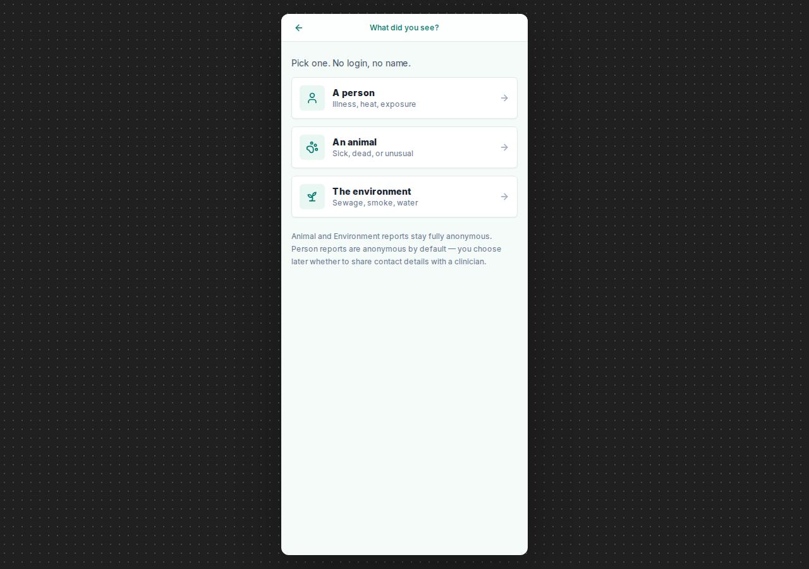
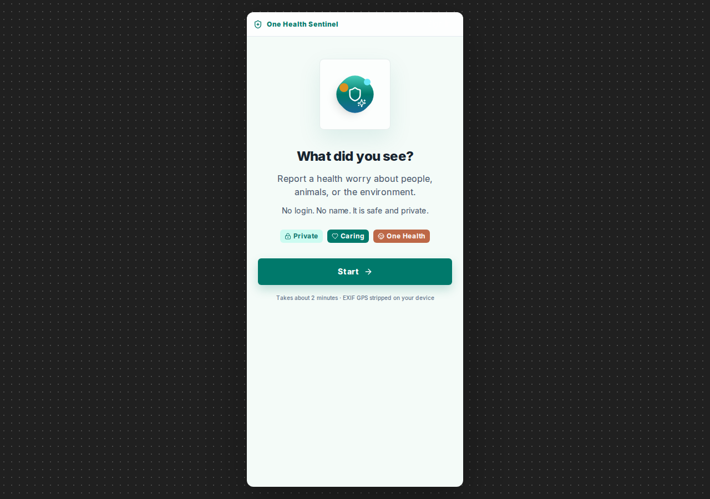
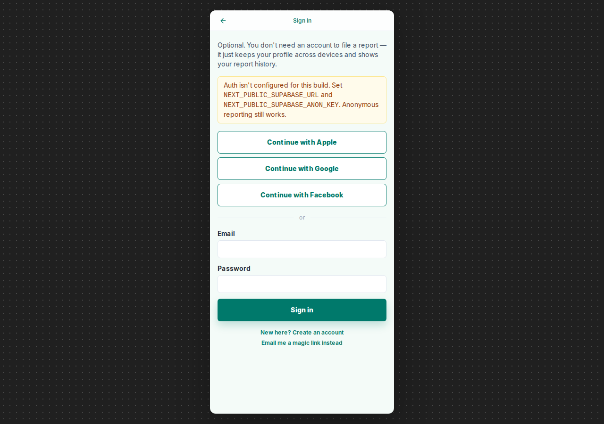

# 06 · Ship the app

!!! info "Source"
    [`plan/06-mobile-app.md`](https://github.com/tyson-swetnam/epihack-2026/blob/main/plan/06-mobile-app.md),
    [`plan/07-auth.md`](https://github.com/tyson-swetnam/epihack-2026/blob/main/plan/07-auth.md),
    [`plan/08-mobile-ux-revamp.md`](https://github.com/tyson-swetnam/epihack-2026/blob/main/plan/08-mobile-ux-revamp.md),
    [`plan/09-mobile-datastore.md`](https://github.com/tyson-swetnam/epihack-2026/blob/main/plan/09-mobile-datastore.md),
    [`api/openapi.yaml`](https://github.com/tyson-swetnam/epihack-2026/blob/main/api/openapi.yaml),
    and [`app/src/`](https://github.com/tyson-swetnam/epihack-2026/blob/main/app/src/).

## What we wanted

A mobile-first reporting app that *feels* anonymous — no required login,
no name, no PII unless the user has explicitly opted in — but lets
motivated users layer a profile on top so the advisories they get back
stay relevant. The bar to file a report had to be lower than the bar to
post on social media, the privacy contract had to be the same whether
the report came from a phone or a laptop, and the whole thing had to
ship as a static export so GitHub Pages could host it for free.

## What we built

A **Next.js 16 + React 19 + TypeScript + Tailwind** app under
[`app/`](https://github.com/tyson-swetnam/epihack-2026/blob/main/app/),
statically exported (`output: 'export'` in
[`next.config.mjs`](https://github.com/tyson-swetnam/epihack-2026/blob/main/app/next.config.mjs))
and published at `/epihack-2026/app/`. The live demo runs on a
Jetstream2 VM at
<http://epihack-test.cis240692.projects.jetstream-cloud.org/>.

### Routes

Every page is a route segment under
[`app/src/app/`](https://github.com/tyson-swetnam/epihack-2026/blob/main/app/src/app/):

| Route | Purpose |
|---|---|
| [`/`](https://github.com/tyson-swetnam/epihack-2026/blob/main/app/src/app/page.tsx) | Welcome — three-button "what did you see?" picker. No login, no name. |
| [`/report/[type]`](https://github.com/tyson-swetnam/epihack-2026/blob/main/app/src/app/report/%5Btype%5D/page.tsx) | The per-type multi-step flow. `[type] ∈ {human, animal, environmental}` is exhaustively pre-rendered by `generateStaticParams`. |
| [`/sign-in`](https://github.com/tyson-swetnam/epihack-2026/blob/main/app/src/app/sign-in/page.tsx) | Supabase magic-link sign-in (optional). |
| [`/auth/callback`](https://github.com/tyson-swetnam/epihack-2026/blob/main/app/src/app/auth/) | OAuth-provider redirect target. |
| [`/account`](https://github.com/tyson-swetnam/epihack-2026/blob/main/app/src/app/account/page.tsx) | Authenticated profile, opt-in toggles, attached-reports list. |
| [`/profile`](https://github.com/tyson-swetnam/epihack-2026/blob/main/app/src/app/profile/page.tsx) | Optional post-submit interstitial — household size, pets, outdoor work. Every toggle defaults to off. |
| [`/dashboard`](https://github.com/tyson-swetnam/epihack-2026/blob/main/app/src/app/dashboard/page.tsx) | Personal dashboard: local weather, active alerts, community leaderboard, weekly-email opt-in. |

### Three primary report flows

The mobile UX revamp ([`plan/08`](https://github.com/tyson-swetnam/epihack-2026/blob/main/plan/08-mobile-ux-revamp.md))
landed three large tap-targets on the home screen — one per
report type — each iconographic and language-independent. From there
the user picks an event class from a closed `EventClass` enum
([`agents/.../api/models.py`](https://github.com/tyson-swetnam/epihack-2026/blob/main/agents/src/onehealth_agents/api/models.py)):

- **Human** — `human.fever_chills`, `human.heat_distress`,
  `human.respiratory`, `human.gastrointestinal`,
  `human.rash_or_bite`, `human.exposure_water`,
  `human.exposure_animal`, `human.animal_bite_scratch`.
- **Animal** — `animal.dead_wildlife`, `animal.dead_livestock`,
  `animal.sick_unusual_behaviour`, `animal.mass_die_off`,
  `animal.unusual_species_sighting`, `animal.pet_sick`,
  `animal.malnourishment`.
- **Environmental** — `env.sewage`, `env.smoke_or_burn`,
  `env.standing_water`, `env.water_quality`, `env.air_quality`,
  `env.illegal_dumping`, `env.food_safety`.

The legacy vanilla-HTML tick mail-in, heat self-report, and "where can I
cool off?" flows still live under
[`app/legacy/`](https://github.com/tyson-swetnam/epihack-2026/blob/main/app/legacy/)
as a read-only archive — the Phase-0 prototype the revamp grew out of.

### The privacy contract on the client

The app does the work the server then re-checks. The relevant code is
under [`app/src/lib/`](https://github.com/tyson-swetnam/epihack-2026/blob/main/app/src/lib/):

- **`exif-stripper.ts`** —
  [`stripExif`](https://github.com/tyson-swetnam/epihack-2026/blob/main/app/src/lib/exif-stripper.ts)
  re-encodes the photo through a canvas (`OffscreenCanvas` when
  available, plain `HTMLCanvasElement` otherwise) so the output never
  carries an EXIF block. `sniffJpegHasGps` walks the first APP1
  segment so the audit trail can record whether the strip was
  load-bearing for that report. If the *output* still contains GPS,
  the function throws — defence in depth before the upload even
  starts. The server runs the equivalent check in
  [`agents/.../api/routes/reports.py`](https://github.com/tyson-swetnam/epihack-2026/blob/main/agents/src/onehealth_agents/api/routes/reports.py)
  and rejects with `photo_exif_gps_present` (422) if anything
  slips through.
- **`coarse-geo.ts`** —
  [`coarsenLatLon`](https://github.com/tyson-swetnam/epihack-2026/blob/main/app/src/lib/coarse-geo.ts)
  snaps to a 1 km grid (0.01° latitude step, longitude step scaled
  by `cos(lat)` so cells stay roughly square at AZ latitudes) and
  emits a stable `g1km:lat,lon` id. `normaliseZip` accepts 5-digit
  or ZIP+4 and returns the 5-digit prefix. The `CoarseLocation`
  schema in
  [`api/openapi.yaml`](https://github.com/tyson-swetnam/epihack-2026/blob/main/api/openapi.yaml)
  accepts only `zip` or `grid_id` — precise lat/lon never appears
  on the wire.
- **`offline-queue.ts`** —
  [`enqueueReport`](https://github.com/tyson-swetnam/epihack-2026/blob/main/app/src/lib/offline-queue.ts)
  parks the JSON payload in `localStorage` (`onehealth:reportQueue`)
  when a submit fails with no response; `flushQueue` replays on the
  next load or `online` event. Photos are dropped on retry — Blobs
  don't belong in `localStorage` — so the retry is text-only and
  idempotent.

!!! tip "What this means for the user"
    The user never sees a coordinate. They tap a map pin or type a ZIP;
    the client snaps to the 1 km cell or the 5-digit prefix and that's
    what crosses the network. Anything finer would have to round-trip
    through an explicit consent token, which the anonymous-first flows
    deliberately don't offer. See
    [App · Privacy](../app/privacy.md) and the full
    [Privacy contract](../architecture/privacy.md).

### The `X-Client-Channel` header

The web build and the Capacitor mobile build ship the same JS bundle.
The only thing that differs is the value of `NEXT_PUBLIC_CLIENT_CHANNEL`
baked in at build time —
[`app/src/lib/api-client.ts`](https://github.com/tyson-swetnam/epihack-2026/blob/main/app/src/lib/api-client.ts)
reads it and adds an `X-Client-Channel: mobile|web` header to every
`POST /v1/reports`:

```ts
const CLIENT_CHANNEL = process.env.NEXT_PUBLIC_CLIENT_CHANNEL ?? 'web';
// …
const res = await fetch(`${BASE}/v1/reports`, {
  method: 'POST',
  headers: { 'X-Client-Channel': CLIENT_CHANNEL },
  body: form,
  signal: opts.signal,
});
```

The FastAPI route at
[`agents/.../api/routes/reports.py`](https://github.com/tyson-swetnam/epihack-2026/blob/main/agents/src/onehealth_agents/api/routes/reports.py)
runs the *same* validation / coarsening / EXIF / triage-guard against
**both** channels and only **then** picks the sink: `mobile` → MongoDB
via `mongo_writer`, anything else → DuckLake via `kg_writer`. A
watermarked, idempotent `mongo_to_ducklake` sync timer replays mobile
documents into DuckLake later. The privacy contract lives in one place;
the storage choice doesn't. [`plan/09-mobile-datastore.md`](https://github.com/tyson-swetnam/epihack-2026/blob/main/plan/09-mobile-datastore.md)
spells it all out.

### Optional profile enrichment

Every toggle on
[`/profile`](https://github.com/tyson-swetnam/epihack-2026/blob/main/app/src/app/profile/page.tsx)
defaults to off. The profile is offered after a successful submit, not
before — the user is already done; the form is there to make the *next*
report easier. The fields are intentionally narrow: household size,
pets, outdoor work, language preference, contact channel. They feed the
context envelope (`GET /v1/context?zip=…`) so the dashboard's advisories
stay relevant to the user's actual exposure profile.

The claim token from the original submit stays in `localStorage` so
`ProfileForm` can `PATCH /v1/reports/{id}/profile` against the
just-filed report. Detaching the profile later severs the
`user_id ↔ observation_id` edge but leaves the observation in the
graph — see [`plan/07-auth.md`](https://github.com/tyson-swetnam/epihack-2026/blob/main/plan/07-auth.md)
Hard-Rule 5 on the right-to-erasure path.

### The personal dashboard

[`/dashboard`](https://github.com/tyson-swetnam/epihack-2026/blob/main/app/src/app/dashboard/page.tsx)
is available to every user — anonymous or signed-in — and surfaces:

- **Local weather** strip (auto-detected from coarse location).
- **Active health alerts** near you (HeatRisk tier, active WNV
  surveillance, etc., pulled through the MCP fan-out).
- **A link into the live map + county resources.**
- **A "your reports" Leaflet map** with a pop-up per dot — the user
  sees *their* report locations only, never anyone else's. At the
  ZIP level they see aggregated local + regional details.
- **A community leaderboard.**
- **Engagement rewards.**
- **A weekly-email opt-in.**

!!! warning "The leaderboard, rewards, and weather strip are demo stubs"
    Per the
    [pitch-vs-repo reconciliation](https://github.com/tyson-swetnam/epihack-2026/blob/main/docs/journey/07-vibe-coding.md):
    the leaderboard, the engagement rewards, the weather strip, and the
    weekly-email opt-in are labelled demo stubs pending a live feed.
    The privacy posture — "your dots, not theirs"; ZIP-level aggregation
    only for community detail — is real and enforced; the engagement
    surface is presentational.

### Supabase magic-link auth (optional)

[`plan/07-auth.md`](https://github.com/tyson-swetnam/epihack-2026/blob/main/plan/07-auth.md)
spells out the rules: **anonymous reporting never requires
authentication**, linking a report to an account is a per-report opt-in,
OAuth identity is PII and never appears on `public.observation`, the
right-to-erasure button is real, no third-party tracking pixels, every
account control defaults conservative.

The client is in
[`app/src/lib/supabase.ts`](https://github.com/tyson-swetnam/epihack-2026/blob/main/app/src/lib/supabase.ts) —
lazily constructed so a missing `NEXT_PUBLIC_SUPABASE_URL` /
`NEXT_PUBLIC_SUPABASE_ANON_KEY` doesn't crash the rest of the app
(`isAuthConfigured()` returns false and the sign-in UI shows a
"configure me" notice instead). `persistSession: true`,
`autoRefreshToken: true`, `detectSessionInUrl: true` for the OAuth
callback fragment.

### The typed contract round-trip

[`api/openapi.yaml`](https://github.com/tyson-swetnam/epihack-2026/blob/main/api/openapi.yaml)
is the source of truth — the privacy boundary, the `CoarseLocation`
schema, the `EventClass` / `SymptomCategory` / `NextAction` enums, the
authenticated-anonymous claim flow. Two consumers:

1. **`app/src/lib/api-types.ts`** is *generated* via `npm run gen:api`
   (which runs `openapi-typescript` against `../api/openapi.yaml`).
   Never hand-edited.
2. **`agents/src/onehealth_agents/api/models.py`** is validated against
   the same spec — the FastAPI handlers and the Pydantic models track
   the spec, not the other way around.

A PR that changes the contract edits the spec first, runs
`npm run gen:api`, and only then touches the route and the client.
The OpenAPI spec is validated in CI on every spec change
(`redocly lint api/openapi.yaml`). Drift surfaces as a typecheck
failure on the client and a Pydantic mismatch on the server — the same
mechanism that caught the "photo Blob vs payload string" 422 in the
first end-to-end deploy
([Vibe-coding · Pivot 5](07-vibe-coding.md#pivots)).

## What it looks like

The home screen — three large tap-targets, no login required, no
chrome above the fold to add friction:


The per-type report flow (here `/report/`) — `[type] ∈ {human,
animal, environmental}` and `EventClass` is a closed enum, so the
form is exhaustively pre-rendered at build time:



The optional personal dashboard, behind a Supabase magic-link
sign-in. Local weather, active alerts, community leaderboard, and a
weekly-email opt-in — the leaderboard, rewards, and weather strip
are demo stubs pending a live feed:



And the sign-in surface itself — magic-link only, no password,
optional in the report flow:



## Decisions & trade-offs

- **Static export over server rendering.** `output: 'export'` means
  `app/` builds to a directory of HTML + JS that GitHub Pages serves
  directly — no Next.js server, no Vercel dependency, no per-request
  cost. `generateStaticParams` on `/report/[type]` exhaustively
  pre-renders the three known types; anything else 404s. The trade-off
  is "no server components reading per-request data" — fine, because
  the app is anonymous-first and reads everything client-side from the
  context envelope.
- **The legacy flows stayed.** [`app/legacy/`](https://github.com/tyson-swetnam/epihack-2026/blob/main/app/legacy/)
  is the original vanilla-HTML tick / heat / cool-off prototype. It's
  read-only, archived, and still works — it's both an honest record
  of where the app started and a fallback surface for the use cases
  the Next.js port hasn't yet absorbed verbatim. The bundler-less
  rule from [`CLAUDE.md`](https://github.com/tyson-swetnam/epihack-2026/blob/main/CLAUDE.md)
  applies there: pinned unpkg URLs, no build step.
- **The X-Client-Channel header lives at exactly one boundary.**
  Set in
  [`api-client.ts`](https://github.com/tyson-swetnam/epihack-2026/blob/main/app/src/lib/api-client.ts);
  read in
  [`reports.py`](https://github.com/tyson-swetnam/epihack-2026/blob/main/agents/src/onehealth_agents/api/routes/reports.py).
  Nothing else looks at it. The agents and the MCP servers see a
  unified post-sync dataset and don't know — or care — which sink the
  report originally landed in.
- **The offline queue is text-only.** Photos are dropped on retry.
  The alternative — IndexedDB-backed Blob storage with a re-upload
  step — is on the roadmap; for the pilot, the calculation is that a
  text-only retry is right almost all the time and a real Blob queue
  is a separate, harder problem.
- **Mock mode is the default for the published site.** With
  `NEXT_PUBLIC_API_BASE=mock` (the GitHub Pages build's setting), every
  call short-circuits to a bundled fixture under `src/mocks/`. The
  site is fully usable without a backend; pointing it at a real
  FastAPI is `NEXT_PUBLIC_API_BASE=http://localhost:8000 npm run dev`.

!!! note "What "anonymous-first" actually means in code"
    The user files a report → `ReportAck` returns an `observation_id`
    and a `claim_token`. That token is the *only* handle the user has
    on their own data — they can read status with it
    (`GET /v1/reports/{id}`), attach a profile with it
    (`PATCH /v1/reports/{id}/profile`), and detach later through the
    [`/account`](https://github.com/tyson-swetnam/epihack-2026/blob/main/app/src/app/account/page.tsx)
    route if they signed in. The server stores the claim token as a
    SHA-256 digest, not the token itself; the audit trail in
    [`agents/.../audit.py`](https://github.com/tyson-swetnam/epihack-2026/blob/main/agents/src/onehealth_agents/audit.py)
    records `input_digest` and `output_digest` for every agent run but
    never the raw payload. Lose the token, lose the handle — that's
    the contract.

## Where to go next

[07 · How we vibe-coded the Sentinel →](07-vibe-coding.md) — the
four-day Claude Code burst that produced the whole stack, including the
mobile-UX pivot from vanilla HTML to Next.js 16 and the datastore split
that gave us the `X-Client-Channel` header in the first place. For the
deeper dives, see [App · Pages](../app/pages.md), [App · Privacy](../app/privacy.md),
and [App · Offline](../app/offline.md).
